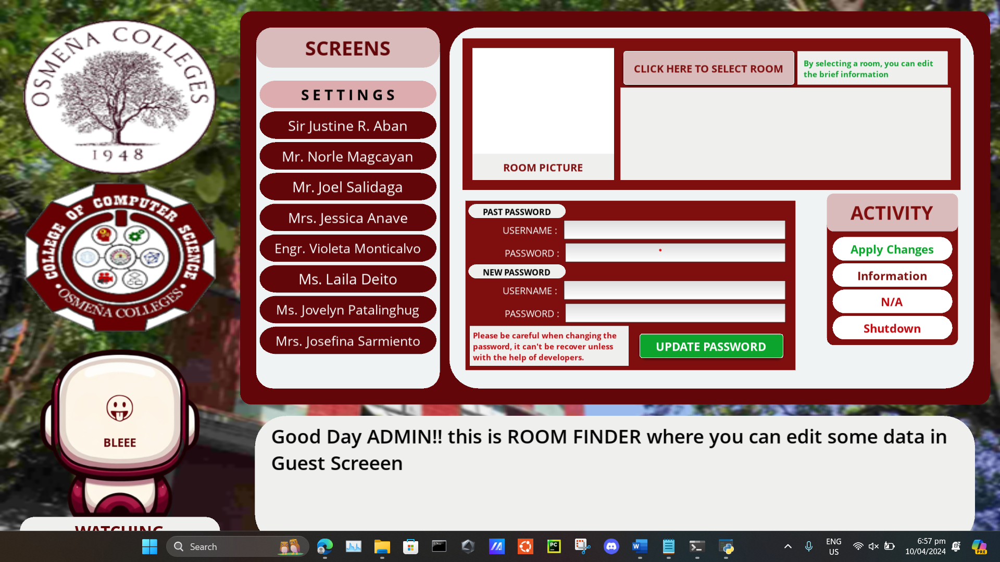

# Admin Interface for GuestOCAI ⚙️

## Short Introduction

The **Admin Interface** is a desktop-based configuration tool designed to manage and maintain system data used by the **GuestOCAI application**.

This interface allows administrators to **modify, update, and manage information provided by the FacultyOCAI system**, ensuring that the GuestOCAI application always operates with updated data.

The application is built using **Python and the Kivy framework**, providing a simple and functional interface for administrators to perform system updates efficiently.

This project demonstrates skills in **GUI development, system integration, and administrative data management**.

---

# Technologies Used

### Programming Language

* Python

### Frameworks

* Kivy
* KivyMD

### Libraries

* Scikit-Learn
* PyAudio
* Text-to-Speech

### Development Concepts

* Desktop Application Development
* System Configuration Tools
* Data Management Interfaces
* Application Integration

---

# Process on How I Built It

1. **Understanding System Requirements**
   The Admin Interface was designed to support the GuestOCAI system by providing administrators with a dedicated interface for managing application data.

2. **Designing the Administrative Interface**
   I created a structured user interface using **Kivy and KivyMD** to allow administrators to easily access configuration options.

3. **Implementing Data Management Features**
   The interface was designed to allow administrators to update or modify information provided by the **FacultyOCAI system**.

4. **Integrating Supporting Libraries**
   Libraries such as **Scikit-Learn, PyAudio, and Text-to-Speech** were integrated to support additional functionalities used within the overall system environment.

5. **Testing and Validation**
   The system was tested to ensure that data updates correctly reflect within the GuestOCAI application.

---

# What I Learned

Through this project, I learned:

* How to design **administrative interfaces for managing system data**
* Developing **desktop applications using Kivy**
* Integrating different modules within a **larger system architecture**
* Structuring applications that support **multiple related systems**
* Managing data flow between system components

---

# Overall Growth

Working on this project helped improve my ability to:

* Build **functional software tools for administrators**
* Design **clean and usable interfaces**
* Develop applications that interact with **other systems**
* Strengthen my skills in **Python-based GUI development**

This project also improved my understanding of **building support tools that maintain and manage larger applications**.

---

# How It Can Be Improved

Possible future improvements include:

* Adding **role-based access control for administrators**
* Implementing **database integration for scalable data management**
* Adding **audit logs for tracking configuration changes**
* Improving the **UI/UX design for easier navigation**
* Creating **real-time synchronization with GuestOCAI**
* Adding **mobile or web-based admin access**

---

# Running the Project

### 1. Clone the Repository

```bash
git clone https://github.com/yourusername/admin-interface.git
cd admin-interface
```

---

### 2. Install Dependencies

```bash
pip install kivy kivymd scikit-learn pyaudio pyttsx3
```

---

### 3. Run the Application

```bash
python main.py
```


## Images 
 
